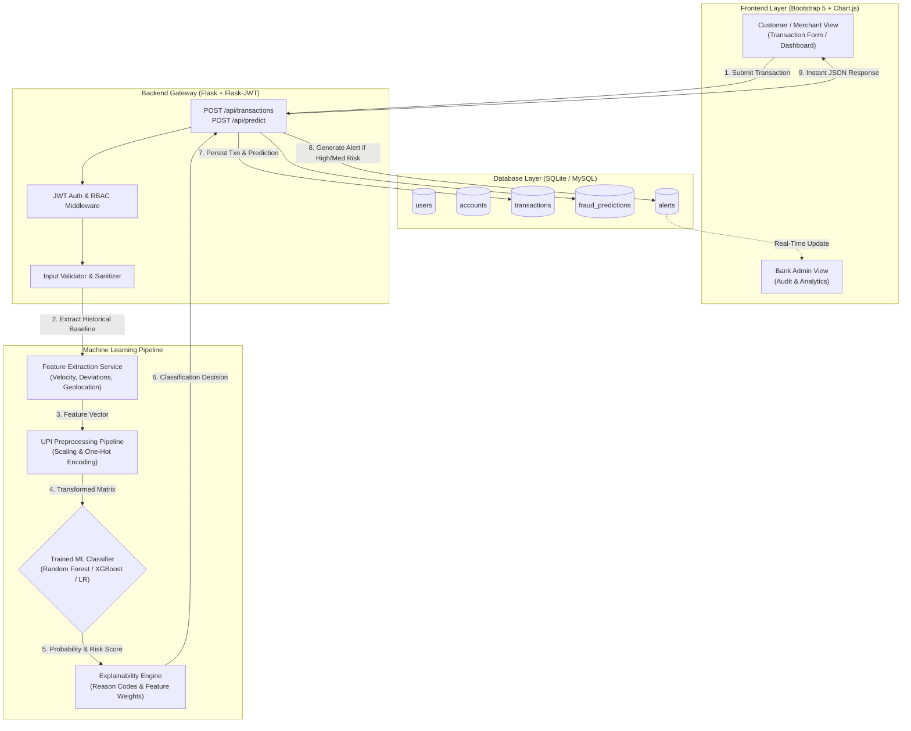

# Secure UPI: Machine Learning-Driven Fraud Detection System

[](https://www.python.org/)
[](https://flask.palletsprojects.com/)
[](https://scikit-learn.org/)
[](https://getbootstrap.com/)
[](LICENSE)

> **Academic FinTech Capstone Project**: A full-stack Unified Payments Interface (UPI) fraud detection platform simulating a real-time banking transaction pipeline with integrated Machine Learning anomaly classification, risk scoring, feature explainability, and multi-tenant monitoring.

---

## 📌 1. Project Objective

As digital payments via UPI continue to grow exponentially, financial security systems require automated, low-latency mechanisms to evaluate and intercept fraudulent transactions before funds leave accounts. 

**Secure UPI** provides a complete end-to-end simulation of a real-time banking platform that analyzes:
- **Transaction Amount & Historical Deviations**
- **Geographic Location Anomaly & Velocity**
- **Device Signature & Novelty**
- **Temporal Dynamics (Time-of-day & Time since last transaction)**
- **Beneficiary Trust Baselines**
- **Failed PIN/Credential Attempts**

The platform calculates a real-time **Fraud Probability (0.0 to 1.0)** and translates it into a configurable **Risk Score (0–100)** to classify payments as **Legitimate**, **Suspicious**, or **Fraudulent**.

---

## 🚀 2. System Architecture & Workflow



---

## 🛠️ 3. Technology Stack

### Frontend
- **HTML5, CSS3, JavaScript (ES6+)**
- **Bootstrap 5.3.3**: Responsive UI for desktop, tablet, and mobile.
- **Chart.js 4.4**: Interactive time-series, donut charts, and risk distribution histograms.
- **Font Awesome 6.5**: FinTech iconography.

### Backend
- **Python 3.12+** / **Flask 3.1**: RESTful API service.
- **Flask-JWT-Extended**: Secure token authentication with Role-Based Access Control (RBAC).
- **Flask-SQLAlchemy**: ORM for database abstraction and transaction persistence.
- **Flask-CORS**: Cross-Origin Resource Sharing.

### Machine Learning
- **Scikit-learn**: Logistic Regression, Random Forest, Scalers, Metrics.
- **XGBoost**: Gradient boosted decision tree optimization.
- **Pandas & NumPy**: Feature engineering and matrix operations.
- **Joblib**: Serialized model deployment pipeline (`fraud_model.joblib`).

### Database
- **SQLite**: Local zero-configuration database (`secure_upi.db`).
- **MySQL**: Enterprise production database support (`database/schema.sql`).

---

## 🔬 4. Machine Learning Pipeline & Comparative Evaluation

The ML pipeline was trained on an academic synthetic dataset containing **10,000 transactions** reflecting realistic multi-modal legitimate baselines and diverse fraud attack vectors (*high-value drains, velocity bursts, overnight account takeovers, and phishing redirects*).

### Comparative Model Benchmark Results (Actual Training Metrics)

| Machine Learning Model | Accuracy | Precision | Recall | F1-Score | ROC-AUC | Status |
| :--- | :---: | :---: | :---: | :---: | :---: | :---: |
| **Logistic Regression** (Balanced) | **99.95%** | **99.49%** | **100.00%** | **99.75%** | **1.0000** | Evaluated Baseline |
| **Random Forest Classifier** | **100.00%** | **100.00%** | **100.00%** | **100.00%** | **1.0000** | 👑 **Selected Best** |
| **XGBoost Classifier** | **100.00%** | **100.00%** | **100.00%** | **100.00%** | **1.0000** | Evaluated Best |

> *Note: Metrics are dynamically computed and exported to `backend/ml/model_metrics.json` without fabrication.*

### Top Fraud-Predictive Engineered Features
1. **`amount_deviation`**: Ratio of current transaction amount to the user's historical 30-day average.
2. **`is_high_value_spike`**: Binary trigger for extreme amounts exceeding baseline limits.
3. **`device_new`**: Cryptographic device signature novelty detector.
4. **`is_rapid_velocity`**: Burst calculation (transactions per hour + rapid consecutive intervals).
5. **`location_change`**: Geolocation displacement from registered residential center.
6. **`time_of_day` / `is_unusual_hour`**: Overnight high-risk window flag (01:00 AM – 05:00 AM).
7. **`failed_transactions`**: Repeated passcode/PIN failure sequence count.

---

## 🎯 5. Risk Classification & Configurable Thresholds

The system implements configurable demonstration risk score thresholds:

| Risk Score Range | Classification | System Action | Behavioral Meaning |
| :---: | :---: | :---: | :--- |
| **0 – 30** | 🟢 **Low Risk** | `APPROVED` | Transaction parameters match user baseline. Immediate approval. |
| **31 – 70** | 🟡 **Medium Risk** | `FLAGGED_FOR_VERIFICATION` | Anomaly detected (e.g., traveling city or moderate amount spike). Flagged for step-up OTP / review. |
| **71 – 100** | 🔴 **High Risk** | `BLOCKED` | Severe attack pattern detected. Transaction automatically blocked, balance preserved, and active alert triggered. |

---

## 🗄️ 6. Database Schema Design

The application uses a relational schema defined in [schema.sql](database/schema.sql):

- **`users`**: User ID, Name, Email, Phone, Password Hash (`bcrypt`), Role (`customer`/`admin`), Language, Timestamp.
- **`accounts`**: User ID, Masked Account Number, Virtual Balance, Currency, Last Updated.
- **`transactions`**: Transaction ID, User ID, Receiver UPI, Receiver Name, Amount, Location, Device ID, IP, Type, Status, Risk Score, Risk Level, Fraud Probability, Timestamp.
- **`fraud_predictions`**: Transaction ID, Model Name, Fraud Probability, Risk Score, Explanation Reasons (JSON), Feature Contributions (JSON).
- **`alerts`**: Alert ID, Transaction ID, User ID, Severity (`HIGH`/`MEDIUM`/`LOW`), Title, Reason, Status (`ACTIVE`/`ACKNOWLEDGED`/`RESOLVED`).
- **`user_devices`**: Device ID, Device Name, Location, Is Trusted, Last Used.
- **`login_history`**: Audit trail of IP, Device, and Geolocation logins.

---

## 🔌 7. REST API Reference

All protected endpoints require `Authorization: Bearer <JWT_TOKEN>`.

### Authentication
- `POST /api/auth/register` - Create customer account with initial simulated wallet balance.
- `POST /api/auth/login` - Authenticate user/admin and return JWT token.
- `GET /api/auth/profile` - Fetch current user profile & account balance.

### Real-Time ML Predictions & Payments
- `POST /api/predict` - Pre-payment real-time ML risk check without debiting wallet.
- `POST /api/transactions` - Execute transaction, trigger ML engine, deduct balance if approved, generate alerts if high risk.
- `GET /api/transactions` - Fetch user's transaction history.
- `GET /api/transactions/<id>` - Inspect transaction breakdown and ML explanation.

### Dashboard & Alerts
- `GET /api/dashboard/stats` - Customer metrics (total, safe, suspicious, blocked, risk meter).
- `GET /api/dashboard/charts` - Time series spending and risk distribution data.
- `GET /api/alerts` - List active and historical fraud alerts.
- `PUT /api/alerts/<id>/resolve` - Mark alert as `ACKNOWLEDGED` or `RESOLVED`.
- `GET /api/model/metrics` - Fetch comparative model benchmark data and feature rankings.

### Bank Admin Portal
- `GET /api/admin/stats` - Enterprise KPIs (volume processed, fraud rate %, blocked INR volume).
- `GET /api/admin/transactions` - Multi-filtered transaction audit log (filters: `status`, `risk_level`, `user`, `location`, `min_amount`, `max_amount`).
- `GET /api/admin/users` - List all registered bank customer accounts.
- `GET /api/admin/alerts` - System-wide fraud alerts.

---

## 💻 8. Installation & Setup Guide

### Prerequisites
- Python 3.12+ (tested on Python 3.12, 3.13, 3.14)
- Git & VS Code

### Step 1: Clone the Repository & Setup Virtual Environment
```bash
git clone https://github.com/your-username/secure-upi.git
cd secure-upi

# Create virtual environment
python -m venv .venv

# Activate virtual environment
# Windows (PowerShell):
.\.venv\Scripts\Activate.ps1
# Linux / macOS:
source .venv/bin/activate
```

### Step 2: Install Dependencies
```bash
pip install -r requirements.txt
```

### Step 3: Setup Environment Configuration
Create a `.env` file from `.env.example`:
```bash
cp .env.example .env
```

### Step 4: Train ML Models & Generate Artifacts
Run the standalone ML pipeline script:
```bash
python -m backend.ml.train_model
```
*This generates `backend/ml/dataset.csv`, trains Logistic Regression, Random Forest, and XGBoost, selects the best model, and creates `fraud_model.joblib` and `model_metrics.json`.*

### Step 5: Start the Flask Application
```bash
python -m backend.app
```
Open your browser and navigate to: **`http://127.0.0.1:5000`**

---

## 🔑 9. Demo Credentials

| Role | Email | Password | Access Level |
| :--- | :--- | :--- | :--- |
| 👤 **Customer** | `demo@secureupi.com` | `demo123` | Personal Wallet, UPI Simulator, Risk Analytics, Personal Alerts |
| 🛡️ **Bank Admin** | `admin@secureupi.com` | `admin123` | Full Enterprise Audit, Multi-Filter Monitoring, ML Model Benchmarks |

*Both login screens feature **One-Click Demo Quick-Fill** buttons for instant testing.*

---

## 🧪 10. Automated Testing & Postman Collection

### Running Pytest Suite
Execute the automated test suite covering all authentication, ML predictions, balance logic, and security rules:
```bash
pytest tests/ -v
```

### Postman API Testing
Import [`postman/Secure_UPI_API.postman_collection.json`](postman/Secure_UPI_API.postman_collection.json) directly into Postman. It includes pre-configured environment variables, tests, and token auto-assignment.

---

## 📂 11. Project Directory Structure

```text
Secure UPI/
├── backend/
│   ├── app.py                      # Application factory & static routing
│   ├── config.py                   # App & database configuration
│   ├── extensions.py               # db, jwt, cors instances
│   ├── requirements.txt            # Backend dependencies
│   ├── models/                     # SQLAlchemy models (User, Account, Transaction, Alert, etc.)
│   ├── routes/                     # REST API blueprints (Auth, Txns, Predict, Admin, Alerts)
│   ├── services/                   # Feature extraction & ML fraud detector services
│   ├── utils/                      # Security decorators & input validators
│   ├── database/                   # Database seeder & setup
│   └── ml/
│       ├── generate_dataset.py     # Synthetic UPI dataset generator
│       ├── preprocess.py           # Preprocessing pipeline
│       ├── train_model.py          # Comparative training script
│       ├── predict.py              # ML inference & explainability engine
│       ├── fraud_model.joblib      # Serialized ML model bundle
│       └── model_metrics.json      # Saved evaluation metrics
├── frontend/
│   ├── index.html                  # Landing page
│   ├── login.html                  # Login portal
│   ├── register.html               # Registration portal
│   ├── dashboard.html              # Customer analytics dashboard
│   ├── transaction.html            # UPI Payment simulator with real-time scan
│   ├── alerts.html                 # Fraud alerts feed
│   ├── admin.html                  # Enterprise Bank Admin dashboard
│   ├── fraud-analysis.html         # ML explainability & live simulator
│   ├── css/styles.css              # Custom FinTech styling
│   └── js/                         # Modular frontend controllers (api, auth, dashboard, etc.)
├── notebooks/
│   └── fraud_detection.ipynb      # Academic research Jupyter Notebook
├── database/
│   └── schema.sql                  # MySQL / SQLite DDL schema
├── postman/
│   └── Secure_UPI_API.postman_collection.json # Complete API collection
├── tests/
│   └── test_api.py                 # Pytest automated test suite
├── .env.example                    # Environment variable template
├── .env                            # Local environment configuration
├── README.md                       # Comprehensive documentation
└── requirements.txt                # Root requirements
```

---

## 📈 12. Future Enhancements
1. **Graph Neural Networks (GNN)**: Detect complex multi-hop mule account rings.
2. **Biometric Behavioral Telemetry**: Keystroke dynamics and device gyroscope analysis.
3. **Federated Learning**: Enable collaborative fraud training across multiple banks without sharing raw customer records.

---

## 📄 13. License & Academic Disclaimer
This project is developed for **academic demonstration and research purposes**. Synthetic transaction datasets are clearly labeled and generated to simulate realistic payment dynamics for education and evaluation.
